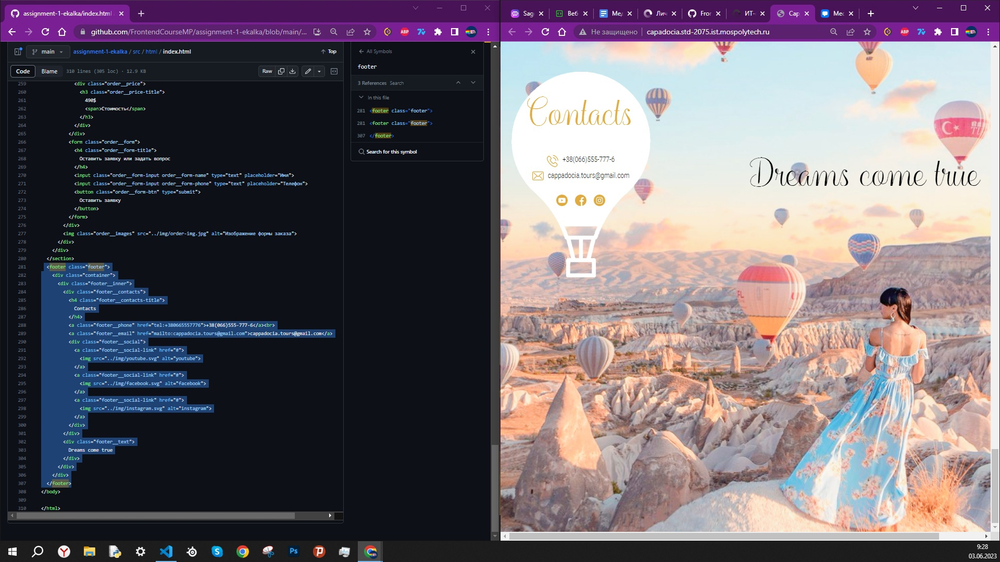
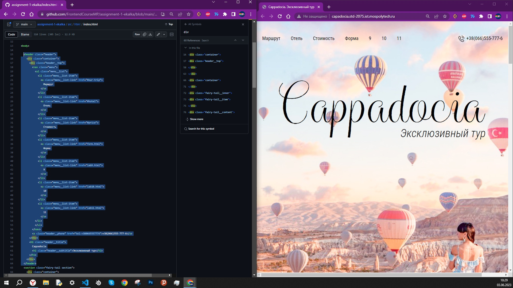
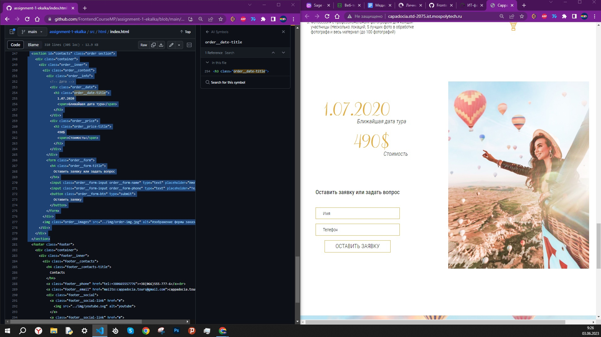
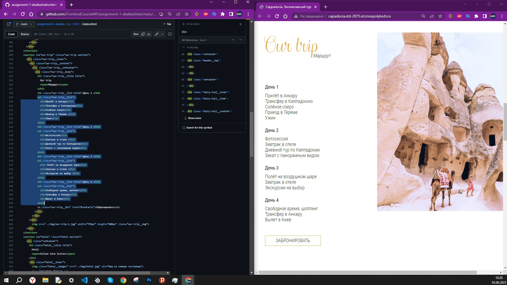

Блоки:

human-body (основной блок)
head (голова)
torso (туловище)
arms (руки)
legs (ноги)
Элементы:

head__eyes (глаза)
torso__heart (сердце)
arms__hand (кисть)
legs__foot (ступня)
Модификаторы:

head__tattoo_left (татуировка на левой стороне головы)
arms__ring_right (кольцо на правой руке)
legs__shoes_sport (спортивная обувь на ногах)
Пример использования BEM-нотации для описания человеческого тела в HTML-коде:

 

  

    

    

  

  

    

  

  

    

    

  

  

    

    

  

 

footer.footer>div.container>div.footer__inner+div.footer__text>div.footer__contacts>h4.footer__contacts-title+br+a.footer__phone+br+a.footer__email+div.footer__social>(a.footer__social-link>img)+(a.footer__social-link>img)+(a.footer__social-link>img)

header.header>div.container+(a.header__phone+h1.header__title>h2.header__subtitle)>div.header__top>nav.menu>ul.menu__list>li.menu__list-item*7>a.menu__list-link

form.order__form>h4.order__form-title+input.order__form-input.order__form-name+input.order__form-input.order__form-phone+button.order__form-btn

(ul.our-trip__list>li*5)+(h4.our-trip__list-title+ul.our-trip__list>li*4)+(h4.our-trip__list-title+ul.our-trip__list>li*3)+(h4.our-trip__list-title+ul.our-trip__list>li*3)